# Dokumentacja symulatora bramek logicznych


# Opis funkcjonalności

Ta sekcja zawiera opis funkcjonalności edytora bramek.

## Panel zarządzania projektami

Po uruchomieniu aplikacji znajdujemy się w panelu zarządzania projektami. Jest to miejsce, w którym możemy tworzyć, otwierać oraz usuwać nasze projekty. Panel zarządzania projektami składa się z nawigacji oraz listy projektów.

### Zarządzanie projektami

#### _Tworzenie projektu_

Aby stworzyć nowy projekt klikamy guzik `Create project`, znajdujacy się w prawej części nawigacji.


Jeżeli nie mamy stworzonego żadnego projektu, możemy również kliknąć w guzik `Create project` w sekcji poniżej.

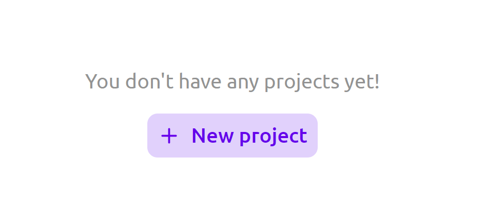

Po stworzeniu projektu jesteśmy automatycznie przenoszeni do edytora symulatora.

#### _Zmiana nazwy projektu_

Stworzony projekt domyślnie nazywany jest `Untitled`. Oczywiście istnieje możliwość zmiany jego nazwy. Aby tego dokonać klikamy lewym przyciskiem myszy na nazwę projektu znajdującą się na jego karcie. Pozwala to na wpisanie nowej nazwy. Odklikniecie myszką w inne miejsce na ekranie, bądź wciśnięcie klawisza `enter` zatwierdza wprowadzone zmiany. Wciśnięcie klawisza `escape` anuluje wprowadzone zmiany. Jeżeli skasujemy nazwę, powrócia ona do poprzedniej zapisanej wartości.

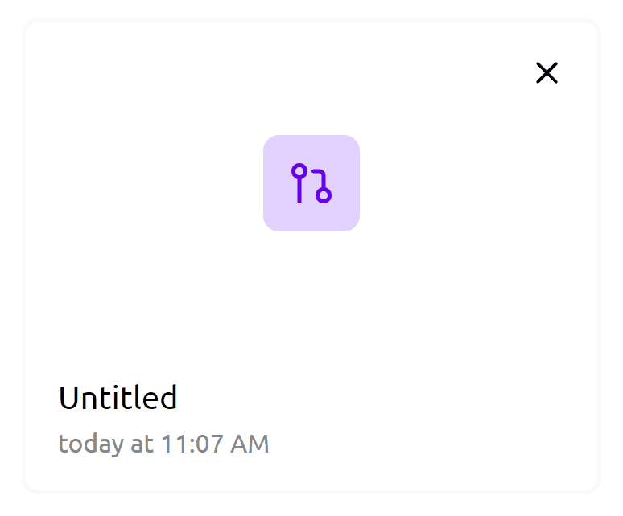

#### _Usuwanie projektu_

Aby usunąć projekt możemy kliknąć w ikonkę `X` w prawym górnym rogu karty projektu. Projekt zostaje wówczas usunięty na zawsze.

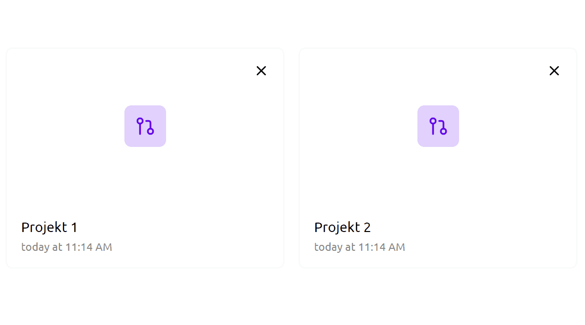

## Edytor

Edytor pozwala na tworzenie nowych układów, symulowaniu ich oraz zapisywaniu do osobnych bloczków. Każdy projekt tworzony jest z pustym edytorem oraz dwoma podstawowymi bramkami logicznymi `and` i `not`.

Edytor składa się z obszaru roboczego, przybornika oraz nawigacji.

### Zarządzanie wejściami i wyjściami układu

#### _Dodawanie wejść i wyjść do układu_

Po najechaniu na żółty plus, znajdujący sie po lewej / prawej stronie obszaru roboczego, rozwija się lista, która pozwala dodać `1`, `2`, `4` lub `8` bitowe wejście / wyjście. Elementy początkowo mają stan `0` (wejścia są wyłączone, a wyjścia nie odbierają żadnego sygnału).

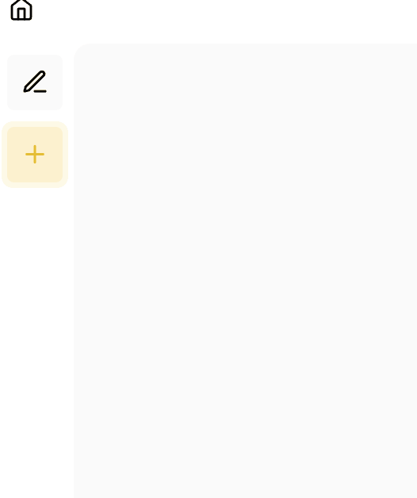

Aby zmienić stan wejścia (pozwala to na testowanie układu w trakcie jego tworzenia) klikamy na nie lewym przyciskiem myszy. Kolor jasnofioletowy reprezentuje stan `0`, a kolor ciemno fioletowy stan `1`.

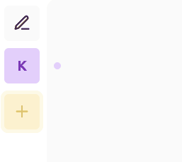

#### _Zmiana nazwy wejść i wyjść_

Wejścia i wyjścia mają automatycznie przypisywaną nazwę (losowa litera angielskiego alfabetu). Można ją zmienić klikając w ikonkę ołówka, która znajduje się na samej górze obszaru wejść / wyjść. Elementy, które mogą mieć zmienioną nazwę zmieniają kolor na szary. Edycję możemy rozpocząć klikając w szare elementy. Podobnie jak w przypadku zmiany nazwy projektów, zatwierdzamy odkliknięciem w inne miejsce lub przyciskiem `enter`. Aby anulować nasze zmiany klikamy przycisk `escape`.


#### _Zmiana kolejności ustawienia wejść i wyjść_

Obszary wejścia i wyjścia pozwalają również układać dodane elementy w odpowiadającej nam kolejności. Przytrzymanie lewego przycisku myszy na elemencie pozwala go przenieśc w miejsce innego elementu.

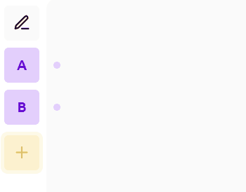

#### _Usuwanie dodanych wejść i wyjść_

Aby usunąć wejście lub wyjście klikamy na nie rolką na myszy (scroll'em) lub lewym przyciskiem myszy przytrzymująć klawisz `alt` (`option` na komputerach od firmy apple).

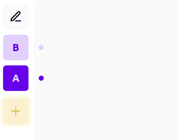

### Edycja głównego układu

#### _Dodawanie bramek_

Aby dodać bramkę do układu przeciągamy ją (`drag and drop`) do obszaru roboczego. Bramka wyświetli się wówczas w miejscu gdzie została opuszona.


#### _Tworzenie połączeń_

Wejścia oraz wyjścia elementu w układzie zaznaczne są poprzez małe kropki po jego lewej oraz prawej stronie. Aby stworzyć połączenie między elementami układu wystarczy przytrzymać lewy przycisk myszy na wyjściu elementu oraz przeciągnąć kabelek do innego wejścia. W tym momencie stan wejścia do którego stworzyliśmy połącznie będzie zależny od stanu wyjścia bramki, od które połącznie zostało poprowadzone.

Kabelek zmienia kolor w zależności od tego na jaki stan ustawia wejście do którego jest podłączony. W przypadku gdy stan ten jest równy 0 kolor kabelka jest szary, a gdy 1 fioletowy.


#### _Usuwanie bramek z układu_

Usunięcie braki z układu działa identycznie jak usuwanie elementów wejścia i wyjścia. Klikamy rolkę na myszce albo lewy przycisk myszy przytrzymująć `alt` (`option` w przypadku komputerów od apple).

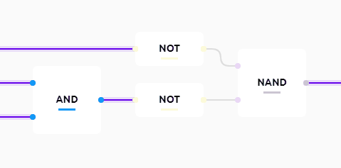

### Nawigacja edytora

Nawigacja edytora posiada kilka ciekawych funkcjonalności, które są bardzo istotne podczas tworzenia układu.


#### _Porządkowanie układu_

Guzik porządkujący układ jest pierwszym guzikiem od prawej strony. Układa on elementy znajdujące się w obszarze roboczym w czytelny sposób.

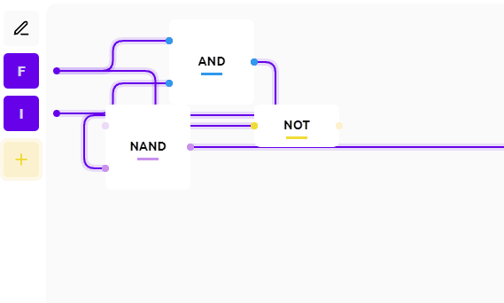

#### _Wyświetlanie nazw wejść i wyjść elementów_

Przycisk pozwalający włączyć podgląd nazw wejść i wyjść znajduje się zaraz obok guzika do porządkowania elementów. Jest reprezentowany przez ikonkę oka. Nazwy wejść i wyjść bramki wyświetlają się obok nich.

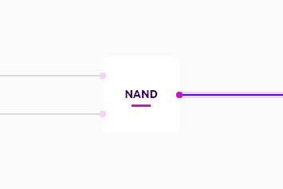

#### _Zapisywanie stworzonych układów_

Przycisk `Create gate` pozwala na tworzenie nowych bramek z aktualnie stworzonego układu. Należy pamiętać, że każda stworzona bramka musi posiadać conajmniej jedno wejście i wyjście.


Po kliknięciu w przycisk wyświetli się formularz, w którym wpisujemy nazwę bramki i wybieramy kolor (jeżeli nie odpowiada nam wylosowany). Aby zapisać nowy element klikamy przycisk `submit`. Jeżli chcemy anulować tworzenie bramki klikamy w przycisk cancel, albo w lekko przyciemnione tło.

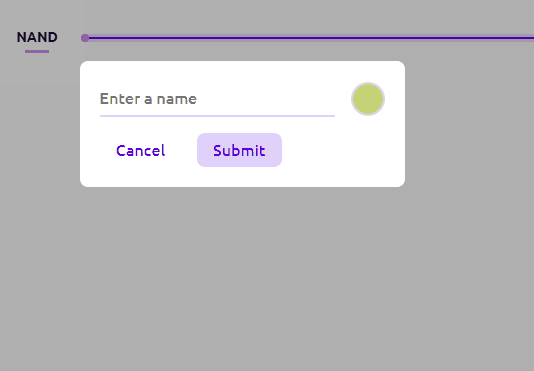

#### _Zmiana nazwy projektu bezpośrednio z edytora_

Aby zmienić nazwę projektu bezpośrednio z edytora klikamy w tytuł projektu po środku nawigacji. Zasady edycji są identyczne jak w panelu zarządzania projektami.


#### _Powrót do panelu zarządzania projektami_

Aby powrócić do panelu zarządzania projektami klikamy w ikonkę domu, po lewej stronie nawigacji.
<br/>


### System edycji bramek

Aby wejść w tryb edycji bramki klikamy na nią podwójnym kliknięciem w przyborniku. Spowoduje to wyświetlenie edytowanej bramki (bramek, wejść i wyjść z jakich jest stworzona) w obszarze roboczym.

Po wejściu w tryb edycji bramki nawigacja zmienia swój kolor na jasnofioletowy. Obok nazwy projektu pojawia się nazwa edytowanej bramki.

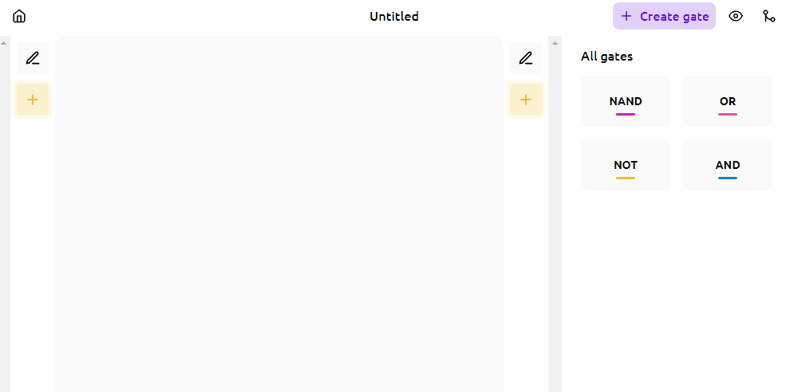

#### _Edycja układu stworzonej bramki_

System edycji bramek pozwala zmieniać strukturę stworzonego elementu (dodawać nowe wejścia, wyjścia i bramki wewnętrzne). Należy pamiętać, że stworzona bramka, nie może korzystać z samej siebie oraz bramki w której jest wykorzystywana.

Aby zatwierdzić edycję klikamy w ikonke znacznika po lewej stronie nawigacji. Aby anulować edycję klikamy w strzałkę obok niego.


#### _Edycja nazwy stworzonej bramki_

Edycja nazwy stworzonej bramki wygląda identycznie jak w przypadku zmiany nazwy projektu (Klikamy w nazwę bramki na nawigacji).


## System Powiadomień

W edytorze został zaimplementowany system powiadomień, który wyświetla informacjie o ewentualnych błędach. Pojawiają się one w lewym dolnym rogu aplikacji.

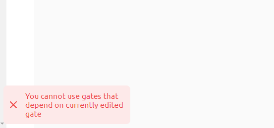

# Dokumentacja techniczna

## Ogólny podział

Aplikacja została podzielona na 3 główne segmenty:

- Symulator
- Adapter
- Renderer

### Symulator

Symulator jest odpowiedzialny za logikę tworzenia układów. To on przechowuje aktualny układ, bramki jakie zostały stworzone, oraz informacje o połączeniach między bramkami.

#### Symulowanie układów

Obliczanie stanu bramek zaczyna się od wejść do układu. Na przykład dla poniższego przykładu:

```cpp
// [n] - indeks wejścia / wyjścia elementu
// (n) - stan wejścia / wyjścia
// element[0](1) - element o wyjściu o indeksie 0 i stanie 1

in[0](1) --> in[0](1)|-------|
                     |  AND  |out[0](0) --> out[0](0)
in[0](0) --> in[1](0)|-------|
```

Symulator przeiteruje przez wszystkie (w tym przypadku 2) wejścia. Dla każdego z nich przeiteruje przez jego połączenia i przekarze aktualny stan na wejście bramki, która zostanie wywołana z zaktualizowanymi stanami wejść, a następnie przekarze swój stan elementom do których jest połączona ... i tak dalej. Kompletna lista operacji (przekazywania stanów / wywołań bramek) dla powyższego układu wygląda następująco:

```cpp
in[0] -> in[0] |and| out[0] -> out[0] // przekazanie wartości pierwszego wejścia do pierwszego wejścia bramki and, wywołanie jej i przekazanie wyniku do wyjścia
in[1] -> in[1] |and| out[0] -> out[0]
```

Po wykonaniu tych operacji otrzymujemy poprawny stan układu dla aktualnych parametrów.

### Renderer

Renderer odpowiada za wyświetlenie układu symulatora użytkownikowi. Sam w sobie przetrzymuje częściowe dane na temat układu, które są niezbędne do wyrenderowania go w elemencie canvas.

### Adapter

Ponieważ początkowo Renderer i Symulator były tworzone osobno, powstała potrzeba połączenia ich w spójną całość. Właśnie to jest zadaniem adaptera. Jest on abstrakcją, która pozwala połączyć logikę Renderera i Symulatora w całość.

## Struktura plików

```cpp
src  // główny folder zawierający kod źródłowy
 |- common // Ogólne funkcje pomocnicze wykorzystywane w projekcie
 |- core // Implementacja symulatora, układu, zarządzanie projektami etc
 |- features // Komponenty i logika strony klienta (komponenty React, Renderer)
 |  |- canvas // Implementacja Renderer'a
 |  |- common // Komponenty reużywane w innych komponentach
 |  |- dashboard // Strona zarządzania projektami
 |  |- editor // Strona edytora, implementacja Adaptera
 |  |- message-bus // Implementacja systemu powiadomień
 |  |- navigation // Implementacja nawigacji
 |  |- sidebar // Implementacja przybornika
 |- styles // style globalne
```