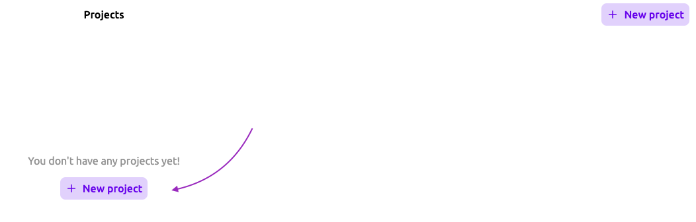

# Dokumentacja symulatora bramek logicznych

## **Opis funkcjonalności**

Ta sekcja zawiera opis funkcjonalności edytora bramek.

---

### **Panel zarządzania projektami**

Po uruchomieniu aplikacji znajdujemy się w panelu zarządzania projektami. Jest to miejsce, w którym możemy tworzyć, otwierać oraz usuwać nasze projekty.

#### **Tworzenie projektu**

Aby stworzyć nowy projekt klikamy guzik `Create project`, znajdujacy się w prawej części nawigacji.

Jeżeli nie mamy stworzonego żadnego projektu, możemy również kliknąć w guzik `Create project` w sekcji poniżej.

Po stworzeniu projektu jesteśmy automatycznie przenoszeni do edytora symulatora.

#### **Zmiana nazwy projektu**

Stworzony projekt domyślnie nazywany jest `Untitled`. Oczywiście istnieje możliwośc zmiany jego nazwy. Aby tego dokonać klikamy lewym przyciskiem myszy na nazwę projektu znajdującą się na jego karcie. Pozwala to na wpisanie nowej nazwy. Odklikniecie myszką w inne miejsce na ekranie, bądź wciśnięcie klawisza `Enter` zatwierdza wprowadzone zmiany. Jeżeli chcemy anulować operację możemy kliknąć klawisz `escape`.

[obrazek]

_Istnieje również druga opcja zmiany nazwy projektu, która zostanie opisana w sekcji opisu funkcjonalności edytora._

Jeżeli skasujemy nazwę, powrócia ona do poprzedniej zapisanej wartości.

[obrazek]

#### **Usuwanie projektu**

Aby usunąć projekt możemy kliknąć w ikonkę `X` w prawym górnym rogu karty projektu.

[obrazek]

Projekt zostaje wówczas usunięty na zawsze.

---

### **Edytor**

Edytor pozwala na tworzenie nowych układów, symulowaniu ich oraz zapisywaniu do osobnych bloczków.

W skład edytora wchodzą:

- nawigacja,
- obszar roboczy,
- przybornik

Każdy projekt tworzony jest z pustym edytorem oraz dwoma podstawowymi bramkami logicznymi `and` oraz `not`.

#### **Zarządzanie wejściami i wyjściami układu**

Po najechaniu na żółty plus, znajdujący sie po lewej / prawej stronie obszaru roboczego, rozwija się lista, która pozwala dodać `1`, `2`, `4` lub `8` bitowe wejście / wyjście. Elementu początkowo mają stan `0` (wejścia są wyłączone, a wyjścia nie odbierają żadnego sygnału).

[gif]

Aby zmienić stan wejścia (pozwala to na testowanie układu w trakcie jego tworzenia) klikamy na nie lewym przyciskiem myszy. Kolor jasnofioletowy reprezentuje stan `0`, a kolor ciemno fioletowy stan `1`.

[gif]

Wejścia / wyjścia mają automatycznie przypisywaną nazwę (losowa litera angielskiego alfabetu). Można ją zmienić klikając w ikonkę ołówka, która znajduje się na samej górze obszaru wejść / wyjść. Elementy, które mogą mieć zmienioną nazwę zmieniają kolor na szary. Zmiana nazwy działa identycznie jak w przypadku zmiany nazwy projektu w panelu zarządzania projektami. Edycję zakańczamy poprzez wciśnięcie klawisza `enter`, bądź poprzez ponowne kliknięcie w ikonkę ołówka.

[gif]

Obszary wejścia / wyjścia pozwalają również układać dodane elementy w odpowiadającej nam kolejności. Przytrzymanie lewego przycisku myszy na elemencie pozwala go przenieśc w miejsce innego elementu.

[gif]

#### **Uzywanie bramek**

...

## **Dokumentacja techniczna**

...
